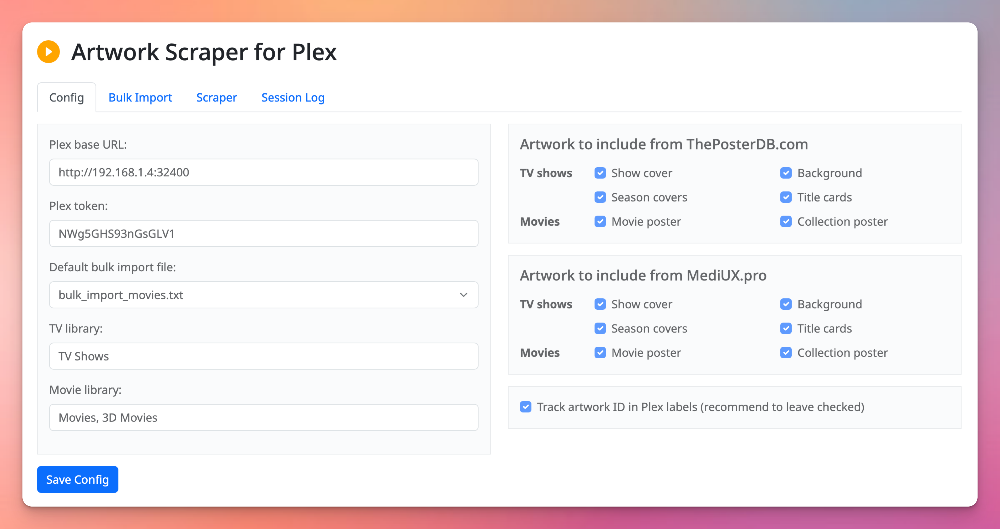
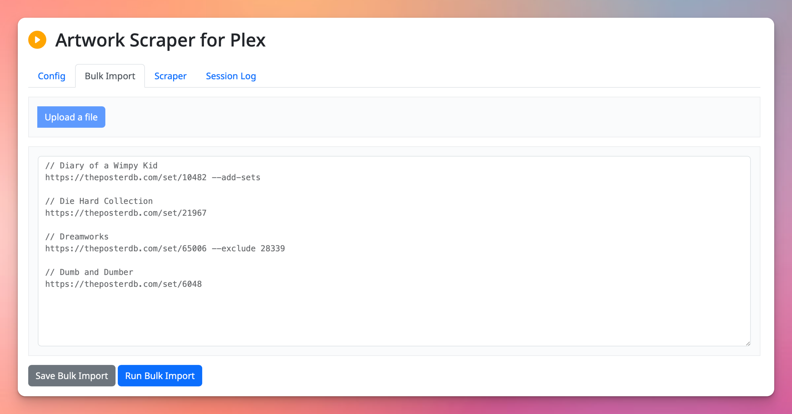
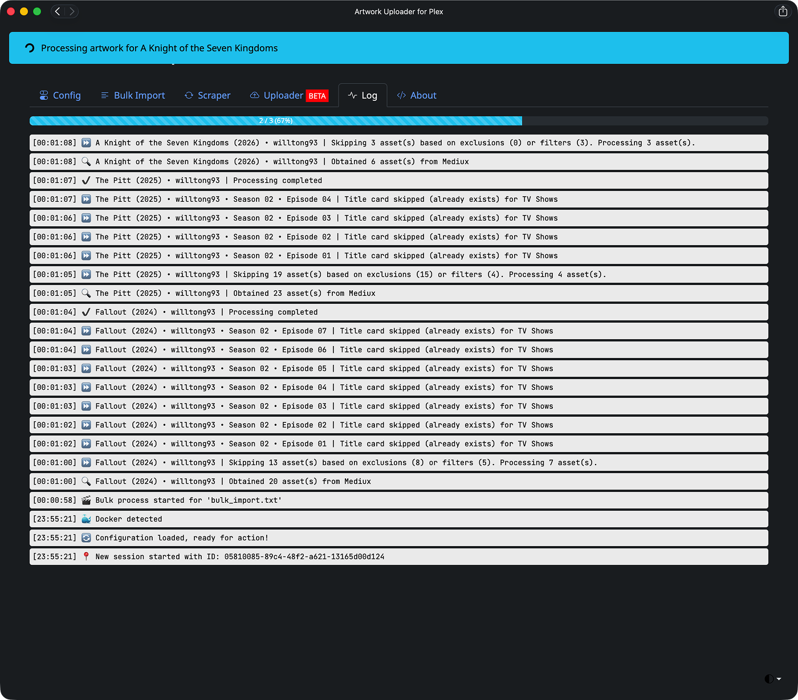
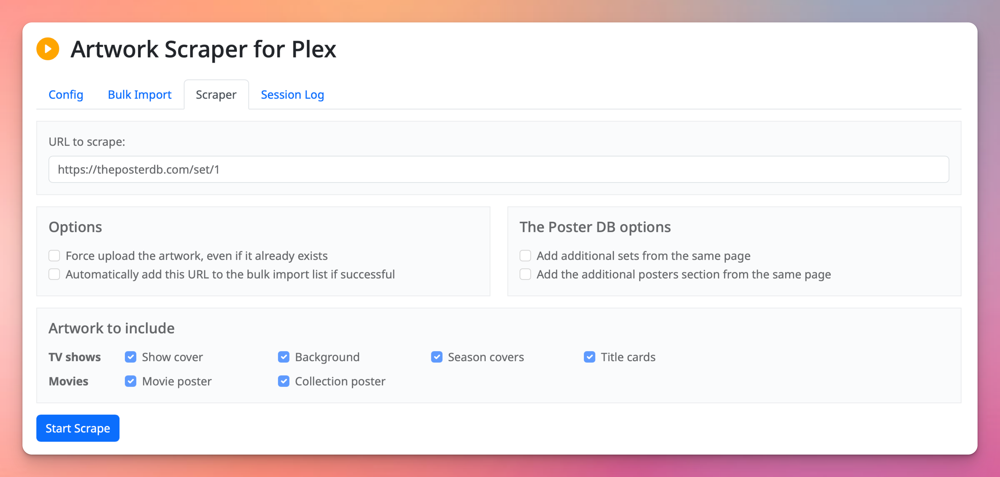
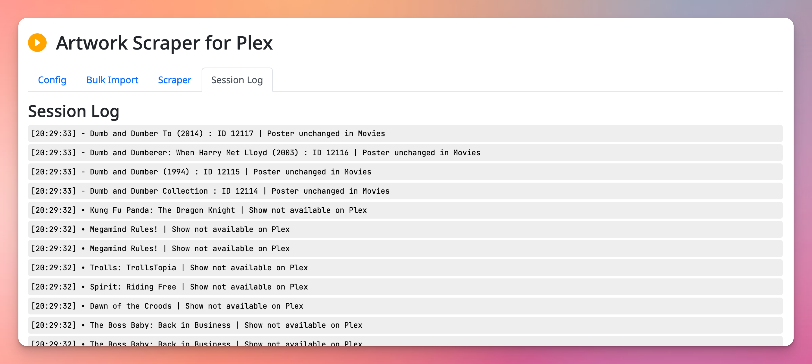

# Artwork Uploader for Plex 
Adapted from a fork of plex-poster-set-helper by Brian Brown

Artwork Uploader is a tool to help upload sets of posters from ThePosterDB or MediUX or scrape posters from MediUX and upload them to your Plex server in seconds!

# What's different from Brian's original app?
### Upload Zip files
You can upload the Zip file you download from theposterdb.com or mediux.pro.  It should handle all types of Zip, including the odd misnamed file from MediUX.  This feature is still in Beta so help me out with some feedback here!
This is also to keep theposterdb happy that we're not breaking their terms of service by scraping.

### Artwork tracking for speedy updates
We (optionally) store an artwork ID in a Plex label against each movie, show, episode and collection, so it can check whether the same artwork is about to be uploaded again.  If it detects the same artwork has been requested, it'll skip it, resulting in a quicker run time.  

### Force artwork to be updated
If you really want to upload artwork again, use the ```--force``` option at the command line, in the bulk file, or when entering the URL in the Web UI.

### ThePosterDB scraping
There are also a couple of new options for thePosterDb, which will allow you to also grab additional sets and additional posters from the same page.  This is sometimes useful for big sets like the Marvel or Disney movies, where you'll otherwise need to specify multiple sets.  This is against the terms of service of theposterdb.com so we encourage you to login, download the files you want, and upload them using this tool, rather than scraping.  Once an API is available we'll switch over ASAP.

### Per-URL filtering and artwork excludes 
And there are other options such as per-URL filtering, fixing missing things that I found while I was using the tool (where I wanted to apply episode title cards but didn't like the season artwork for example).  And if you don't like a particular piece of artwork or poster from a set, you can now exclude it.

### Kometa support
Kometa can be supported in two different ways. The simplest way is for the script to reset Kometa's overlay label so the next time Kometa runs the overlay gets added to the new artwork (`reset_overlay` set to `true` in config.json). Alternatively, if you're using Kometa's [asset directory](https://kometa.wiki/en/latest/kometa/guides/assets/) to manage all your Plex custom art, you can check the option to save the artwork to the Kometa asset directory instead of applying it direectly to Plex (either in the GUI or by setting `save_to_kometa` to `true` in the config.json file). In that case, whenever Kometa runs again it will apply all new or updated artwork with its corresponding overlays. If this option is enabled, you will have to set the Kometa base directory (`kometa_base` in the config file, or with the appropriate text field in the GUI) to the base asset directory.

Kometa asset directory support works on the following assumptions:

- `asset_folders` is set to `true` in Kometa's config.yml, so that each TV show or movie has its own dedicated folder for its artwork assets
- `assets_for_all` should be set to `true` in each library
- `assets_for_all_collections` should be set to `true` in each library (if you want ot manage collection assets)
- `create_asset_folders` should be set to `true`
- Each library has a folder that matches the library name under the base asset directory
- Collections have their assets stored in the same folders as the movies or TV shows in the same library

Here's a snippet of the config.yml file:

```yaml
libraries:                           # This is called out once within the config.yml file
  Movies:                            # These are names of libraries in your Plex
    settings:
      asset_directory:
        - config/assets/Movies
      create_asset_folders: true
    operations:
      assets_for_all: true
      assets_for_all_collections: true        
  [...]

  TV Shows:
    settings:
      asset_directory:
        - config/assets/TV Shows
      create_asset_folders: true
    operations:
      assets_for_all: true
      assets_for_all_collections: true
   [...]

settings:
  [...]
  asset_directory:
  - config/assets
  asset_folders: true
  asset_depth: 2
  create_asset_folders: true
  [...]
```

The structure of your Kometa asset directories should look like this:

```
  path/to/base/asset/directory
  ├── Movies
  │   ├── Death in Venice (1971)
  │   │   ├── poster.jpg
  │   │   └── background.jpg
  │   ├── Die Another Day (2002)
  │   │   └── poster.png
  │   ├── Spy Kids Collection
  ·   ·   ├── poster.jpg
  ·   ·   └── background.png
  │   └── The Amazing Spider-Man (2012)
  │       └── background.jpg
  ├── Movies 4K
  │   ├── 10 Cloverfield Lane (2016)
  │   │   ├── poster.jpg
  │   │   └── background.png
  │   ├── 28 Weeks Later (2007)
  │   │   └── poster.png
  ·   ·
  ·   ·
  │   └── Zootopia (2016)
  │       └── poster.jpg
  ├── TV Shows
  │   ├── Ted Lasso (2020) {tmdb-97546}
  │   │   ├── poster.png
  │   │   ├── Season01.jpg
  │   │   ├── Season02.jpg
  │   │   ├── Season03.jpg
  │   │   ├── S01E01.jpg
  │   │   ├── S01E02.jpg
  │   ·   ·
  │   ·   ·
  │   │   └── S03E12.jpg
  ·   ·
  ·   ·
  │   └── Alien - Earth
  │       ├── poster.jpg
  │       └── background.png
  └── TV Shows 4K
      ├── Foundation (2021)
      │   ├── poster.png
      │   ├── Season01.jpg
      │   ├── Season02.jpg
      ·   ├── Season03.jpg
      ·   └── background.png
      │
      └── Tales From The Loop
          ├── poster.png
          └── background.png

```

Finally, if you're using the Kometa asset directory and you're running the script in a Docker container, the script will detect that it's running in Docker (via the RUNNING_IN_DOCKER environment variable) and will hardcode the Kometa base directory to ```/assets``` and the temp directory to ```/temp```. You must therefore map the asset directory base and temp folders to these paths inside the container. This allows you to keep your real paths to your Kometa base and temp folders in the config.json file so if you run the script manually from outside the container it will also work. Your ```docker-compose.yml``` file should look like this:

```yaml
services:
  artwork_uploader:
    build: .
    ports:
      - "4567:4567"
    volumes:
      - ./bulk_imports:/artwork-uploader/bulk_imports:rw
      - ./config.json:/artwork-uploader/config.json:rw
      - C:\Users\<USERNAME>\Kometa\config\assets:/assets:rw
      - C:\Temp\assets:/temp:rw
    environment:
      - TZ=Etc/UTC
      - PYTHONUNBUFFERED=1
      - RUNNING_IN_DOCKER=1
```

### Year matching
Sometimes the year on Plex and the year at the artwork provider is different.  Use the --year <year> argument to set the Plex year, so the artwork matches.  Also available in the Web UI and bulk files.

### Clean up your bulk files
Plus you can allow your bulk file to be auto-managed (cleaned and sorted for you).  It's not really production ready yet but works just fine I think - do let me know!

### Web UI
Oh, last but not least, there's now a shiny new web UI so you can leave it running on your Plex Server and access it remotely!


### Scheduler
Basic scheduler, so that you can leave this running and update all your artwork every day. 

The basic version is available now on the bulk imports page, click on the clock to enable or disable per file.  

It's there for when we have API access (and works for scrapers in the meantime) but is limited to running once a day which should be fine.

## Coming soon
- API integration with MediUX so we don't need to scrape any more.  I've been in contact with them to get access to the API as soon as it's launched.

## Thanks
Many thanks to Brian Brown [@bbrown430] (https://github.com/bbrown430) for the original plex-poster-set-helper - what a fantastic idea!  It's saved me a load of time, and it's made my Plex beautiful!  And it's made me learn a bit of Python too!  I really hope you don't mind me taking your work and running with it, please get in touch if you'd like to merge the two projects!

## Disclaimer
This is a first project for me, i'm using it to learn Python so it will be constantly changing as I learn more.  I therefore don't offer any support further than my own knowledge, or any guarantee that it will actually work!  Any help would be appreciated, so feel free to contribute.   I am also aware that scraping breaks the terms of service of TPDb so please consider using the upload Zip feature from there.  Wish these sites had APIs!

## For Developers
If you're interested in contributing to this project or want to understand how it works under the hood, check out the [Technical Information for Contributors](TECHNICAL_INFO.md) which includes:
- Architecture overview
- Service layer documentation
- How to add new features
- Testing procedures
- Code style guidelines

---
# Installation

### 1. Install Python
[Install Python](https://www.python.org/downloads/) (if not installed already).  You'll need version 3.10 or later.

### 2. Get Artwork Uploader for Plex
Either download the Zip and extract all files into a folder, or Git Clone the repository

### 3. Open a terminal 
Then CD to the folder where you extracted Artwork Uploader

### 4. Install the required dependencies

```bash
   pip install -r requirements.txt
   ```

You may need to use ```python3 -m pip install -r requirements.txt```

### 5. Rename ```example_config.json``` to ```config.json```.  
This is optional - if you don't do this, a new config.json will be created when you first run the utility and you'll be prompted to edit the config.

### 6. Edit your config.json to provide the following information:  

```"base_url"```  
- The IP address (and port) of your Plex server. e.g. "http://12.34.56.78:32400/".

```"token"```  
- Your Plex token (can be found [here](https://support.plex.tv/articles/204059436-finding-an-authentication-token-x-plex-token/)).

```"tv_library"``` 
- The name of your TV Shows library (e.g., "TV Shows"). Multiple libraries are also supported (see the **Multiple Libraries** section below).

```"movie_library"```  
- The name of your Movies library (e.g., "Movies"). Multiple libraries are also supported (see the **Multiple Libraries** section below).

```"mediux_filters"```
- See the list of filter options below.  Anything not in this list will not be uploaded unless requested in the command line, in the bulk file or in the scraper URL in the Web UI.

```"tpdb_filters"```
- See the list of filter options below.  Anything not in this list will not be uploaded unless requested in the command line, in the bulk file or in the scraper URL in the Web UI.

```"track_artwork_ids"```
- Setting this to ```true``` will result in speedy scraping re-runs.  It uses Plex labels to store a special ID for the artwork, so that next time, we can check if the scraped artwork is the same as the current artwork and skip re-uploading.
- By setting this to ```false```, it'll upload every artwork every time you run (like using the --force option for every item).  This can result in long run-times, especially if you're using ThePosterDB.  We recommend you leave this as **true** and use --force when you need to!

```"auto_manage_bulk_files"```
- Setting this to ```true``` will automatically add, label and sort URLs from the scrape tab into the currently loaded bulk import file.  At the moment it won't auto-save, but I might add that later.
- Setting to ```false``` will leave the organisation of your bulk files up to you.

```"reset_overlay"```
- Setting this to ```true``` will remove the Overlay label that Kometa uses when we upload new artwork, so Kometa can reapply any overlays in future
- Setting to ```false``` will leave the Overlay label as it is, Kometa will not re-apply your overlays.

```"save_to_kometa"```
- Setting this to ```true``` will save scraped artwork to the Kometa asset directory
- Setting to ```false``` will keep the original behavior where the artwork will be immediately applied to Plex directly

```"kometa_base"```
- Path to your Kometa base asset directory

```"temp_dir"```
- (Optional) Path to temporary save directory that can be used for testing purposes when using the ```--temp``` argument in the CLI

### Filter options
Both mediux_filters and tpdb_filters specify which artwork types to upload by including the flags below.  Specify one or more in an array ["show_cover, "title_card"]
      - show_cover
      - background
      - season_cover
      - title_card
      - movie_poster
      - collection_poster

---
# Usage

## Docker 

If you want to use Docker, there is a Dockerfile in the repo to allow it to be deployed in a container alongside a plex container. 

Clone the repository and use the `docker-compose.yml` file to deploy it with docker compose. Or copy this block in a `docker-compose.yml` file pointing to the location of the repository to build the image instead of the `.` 

```yaml
services:
  artwork_uploader:
    build: .
    ports:
      - "4567:4567"
    volumes:
      - ./bulk_imports:/artwork-uploader/bulk_imports
      - ./config.json:/artwork-uploader/config.json
    environment:
      - PYTHONUNBUFFERED=1
```

And run 
```bash
docker compose up -d
```

## Directly as a python script

**NOTE**: THIS REQUIRES AT LEAST PYTHON 3.10.  You will encounter odd errors in the scraping log for earlier versions of Python, due to a bug that was fixed in 3.10.

### Running the Application

**If you created a virtual environment (recommended):**
```bash
# Activate the virtual environment first
source .venv/bin/activate  # macOS/Linux
# or
.venv\Scripts\activate     # Windows

# Then run normally
python artwork_uploader.py
```

**If NOT using a virtual environment:**
```bash
python artwork_uploader.py
# or
python3 artwork_uploader.py
```

**💡 Tip:** If you get dependency errors, you're probably not using the virtual environment. See [Troubleshooting](#troubleshooting) below.

With no arguments, Artwork Uploader will start a webserver on port 4567 (this may change!)

## Command Line Arguments

The script supports various command-line arguments for flexible use.

### 1. Single link import  
   Provide a link directly to set posters from a single set of posters:
   
```bash
   python artwork_uploader.py https://mediux.pro/sets/9242
   
   or, depending on your environment
   
   python3 artwork_uploader.py https://mediux.pro/sets/9242
   
```
#### Optional command line arguments

```--add-sets``` will also parse any additional sets when using the Poster DB 
    
```--add-posters``` will also parse the additional posters section of the set, when using the Poster DB
   
```--force``` will force the artwork to be updated even if it's the same as the one on plex already - or maybe you changed the artwork manually and want to override it...
    
```--exclude <id1> [<id2> <id3> ...]``` will exclude the poster or artwork with the specified ID from being uploaded.  Grab the ID from the session log...
- ThePosterDB is a number
- MediUX is a UUID
- For TV shows, you can also exclude specific episodes or entire seasons:
  - ```--exclude s01e05``` - Excludes season 1 episode 5
  - ```--exclude s1e5``` - Same as above (both formats work)
  - ```--exclude s02``` - Excludes all episodes in season 2
  - ```--exclude s00e01 s02``` - Excludes specials episode 1 and all of season 2
  - You can mix artwork IDs and episode/season patterns in the same command
    
```--filters <filter1> [<filter2> <filter3> ...]``` will **only** upload the selected artwork types, based on the options below
- show_cover
- background
- season_cover
- title_card 
- movie_poster
- collection_poster
    
```--year <year>``` will override the year that it will look for in Plex.  Sometimes the year in Mediux or TPDb doesn't match the year of the show or movie in Plex, therefore won't update the artwork.  Use this option with the year in Plex to force a match.  Will be ignored in bulk mode, where you should specify this on a per-line basis.

```--kometa``` will save artwork your Kometa asset directory instead of applying it to Plex directly. If ```save_to_kometa``` is set to ```true``` in config.json then this argument is not necessary. If a specific artwork already exists in the Kometa asset directory, it will not be overwritten unles the ```--force``` argument is also specified.

```--temp``` for testing purposes, will save artwork to a temporary directory ```temp_dir``` specified in config.json instead of the Kometa asset directory.

### Using these options in files and GUI

   These options can also be used in the URL scraper GUI, and in your bulk file, just add them straight after the URL in each line, for example 
   ```
   https://theposterdb.com/set/71510 --add_posters --force
   ```

## Bulk Files
   Import multiple links from a .txt file using the bulk argument:
   
```bash
   python artwork_uploader.py bulk bulk_import.txt
   ```

   - The .txt file should contain one URL per line. Lines starting with # or // will be ignored as comments.

   - **If no text file parameter is provided, it will use the default value from config.json for bulk_txt.**

---
# Troubleshooting

## Common Issues

### "Required dependencies are missing or incompatible"

This error occurs when Python packages can't be imported. Common causes:

#### 1. **Requirements not installed**
```bash
pip install -r requirements.txt
# or
python3 -m pip install -r requirements.txt
```

#### 2. **Wrong Python version**
Artwork Uploader requires Python 3.10 or later. Check your version:
```bash
python3 --version
```

#### 3. **Architecture mismatch (Apple Silicon Macs)**
If you're on an Apple Silicon Mac (M1/M2/M3) and see errors about "incompatible architecture (have 'x86_64', need 'arm64')", your packages were compiled for Intel chips.

**Solution: Reinstall packages for ARM64:**
```bash
pip3 uninstall Pillow Flask flask-socketio eventlet cffi cryptography -y
pip3 install Pillow Flask flask-socketio eventlet cffi cryptography
```

#### 4. **Use a virtual environment (Recommended)**
Virtual environments prevent conflicts and ensure clean installations:

```bash
# Create virtual environment
python3 -m venv .venv

# Activate it
source .venv/bin/activate  # On macOS/Linux
# or
.venv\Scripts\activate     # On Windows

# Install requirements
pip install -r requirements.txt

# Run the application
python artwork_uploader.py
```

**IMPORTANT: Always activate the virtual environment before running!**

If you created a `.venv` but are still getting import errors, you're likely using system Python instead of venv Python:

```bash
# Wrong - uses system Python ❌
python3 artwork_uploader.py

# Right - activate first, then run ✅
source .venv/bin/activate
python artwork_uploader.py

# Alternative - run directly from venv ✅
.venv/bin/python artwork_uploader.py
```

### "Cannot access localhost:4567" or "Server won't start"

If you see the scheduler messages but can't access the web UI:

1. **Check you're using the virtual environment** - See above section
2. **Check if another process is using port 4567**:
   ```bash
   lsof -i :4567
   # If something is using it, either kill it or change the port in config.json
   ```
3. **Try accessing with different URLs**:
   - `http://localhost:4567`
   - `http://127.0.0.1:4567`
   - `http://0.0.0.0:4567`
4. **Check firewall settings** - Ensure port 4567 is not blocked

### Strange "400 Bad request" errors in logs with binary data

If you see errors like this in your logs:
```
127.0.0.1 - - [13/Oct/2025 12:21:30] code 400, message Bad request version ('\x16\x03\x01...')
```

**This is completely normal and harmless!** These are TLS/SSL handshake attempts - something (your browser, browser extensions, or system security tools) is trying to connect via HTTPS to the HTTP-only Flask server.

Flask correctly rejects these with a 400 error since it doesn't support HTTPS by default. You can safely ignore these messages - they don't affect functionality.

### "eventlet monkey_patch" errors

If you see errors related to eventlet on Python 3.13, consider using Python 3.11 or 3.12 instead, as eventlet has known compatibility issues with Python 3.13.

```bash
# Install Python 3.12 via Homebrew (macOS)
brew install python@3.12

# Create venv with Python 3.12
python3.12 -m venv .venv
source .venv/bin/activate
pip install -r requirements.txt
```

### Plex connection issues

**"Cannot reach Plex server" or Application hangs on startup**

The application now has a 3-second timeout for Plex connections and will show a clear error message if it can't connect:

```
======================================================================
WARNING: Could not connect to Plex TV libraries
======================================================================
Cannot reach Plex server at http://192.168.1.4:32400. Please check
that the server is running and the address is correct.

The web UI will still start, but you won't be able to upload artwork
until you fix the Plex connection in Settings.
```

**How to fix:**

1. **Verify Plex is running** - Check that your Plex Media Server is started
2. **Test connectivity manually**:
   ```bash
   curl http://your-plex-ip:32400
   # Should return some XML if Plex is accessible
   ```
3. **Check IP address** - Your Plex server IP might have changed. Common locations:
   - Plex Web App → Settings → Network → Show Advanced
   - Look for "LAN Networks" or external IP
4. **Update config.json**:
   ```json
   {
     "base_url": "http://192.168.1.100:32400",
     "token": "your-plex-token"
   }
   ```
5. **Firewall/Network** - Ensure port 32400 isn't blocked

**"Invalid Plex token or base URL"**
- Verify your Plex token is correct in `config.json`
- Get token from: [Finding your Plex token](https://support.plex.tv/articles/204059436-finding-an-authentication-token-x-plex-token/)
- Ensure the base URL includes the protocol and port (e.g., `http://192.168.1.100:32400`)

**"Library not found"**
- Check library names match exactly (case-sensitive)
- Verify library type (TV vs Movie) matches your config
- Library names in config must match exactly what's in Plex

### Scraping issues

**"Can't scrape URL"**
- Verify the URL is from a supported source (ThePosterDB or MediUX)
- Check your internet connection
- Some scrapers may be rate-limited; wait a few minutes and try again

### Performance issues

**Slow upload speeds**
- ThePosterDB has a 6-second rate limit between requests
- Use `--filters` to only upload specific artwork types
- Enable `track_artwork_ids` in config to skip already-uploaded artwork

---
# Other features

## Web UI
It's still work in progress, as is this entire app!  I wouldn't consider it "production" ready but it's fully functional!








## Multiple Libraries

To target multiple Plex libraries, modify config.json as follows:

```json
"tv_library": ["TV Shows", "Kids TV Shows"],
"movie_library": ["Movies", "Kids Movies"]
```

Using these options, the tool will apply artwork to the same media in all specified libraries.

## Bulk Import

1. Use the bulk argument to import your default `bulk_text` file specified in `config.json`.
2. Or, specify the path to a .txt file containing URLs as a second argument. Each URL will be processed to set the artwork for the corresponding media.

## Filters

Both the ```mediux_filters``` and ```tvdb_filters``` options in **config.json** allows you to control which artwork types are uploaded to Plex on a global level.  You can also set these global filters in the GUI and in the Web UI.

```show_cover``` - Upload a cover for the TV show

```background``` - Upload background images

```season_cover``` - Upload covers for each individual season

```title_card``` - Upload title cards for individual episodes

```movie_poster``` - Upload posters for movies

```collection_poster``` - Upload posters for collections

### Using the above filters 
#### These filters can be used from many places...
- In ```config.json```, which will apply filters globally for each provider.  
- These options can also be set from the Web UI

### The global filters can then be overridden on a per-URL basis...

- On the command line, by using ```--filters <filter1> [<filter2> <filter3>...]```
- After the URL in a bulk file using the same format as you would on the command line
- After the URL in the Bulk Import tab of the Web UI or local GUI using the same format as you would on the command line
- In the scraper tab in the Web UI, where you can simply check boxes to set options and filters.

