<p align="center">
  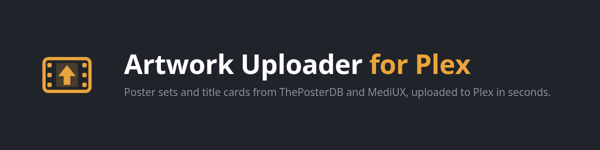
</p>

<p align="center">
  Upload poster sets from ThePosterDB and MediUX to your Plex server, or save them to your Kometa asset directory, in seconds.
</p>

<p align="center">
  <a href="https://github.com/mscodemonkey/artwork-uploader-plex/actions/workflows/tests.yml"></a>
  <a href="https://github.com/mscodemonkey/artwork-uploader-plex/releases/latest"></a>
  <a href="https://github.com/mscodemonkey/artwork-uploader-plex/pkgs/container/artwork-uploader"></a>
  
</p>

---

Artwork Uploader takes a poster set URL (or a downloaded Zip file) from [ThePosterDB](https://theposterdb.com) or [MediUX](https://mediux.pro) and applies the artwork to the matching movies, shows, seasons, episodes and collections in your Plex libraries. Run it from the web UI, the command line, or on a schedule, and let it keep your libraries beautiful while you sleep.

It started life as a fork of Brian Brown's [plex-poster-set-helper](https://github.com/bbrown430/plex-poster-set-helper) and has grown into a full application with a web UI, a scheduler, artwork tracking, Sonarr/Radarr webhooks and Kometa integration.

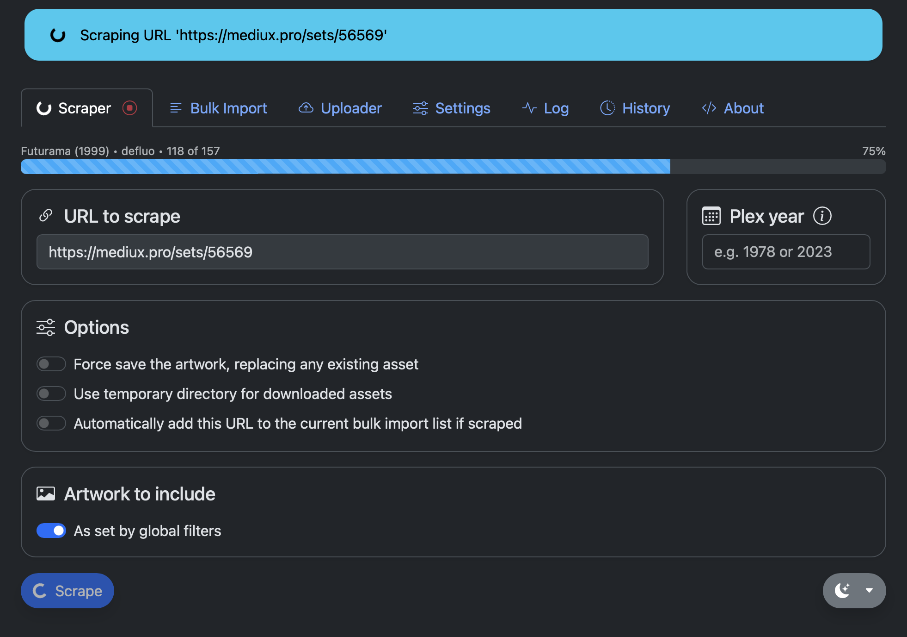

## Contents

- [Features](#features)
- [Installation](#installation)
  - [Docker (recommended)](#docker-recommended)
  - [From source](#from-source)
- [Settings](#settings)
- [Usage](#usage)
  - [Web UI](#web-ui)
  - [Command line](#command-line)
  - [Bulk files](#bulk-files)
  - [Scheduler and notifications](#scheduler-and-notifications)
  - [Automatic artwork for new imports (Sonarr/Radarr webhook)](#automatic-artwork-for-new-imports-sonarrradarr-webhook)
  - [Kometa integration](#kometa-integration)
- [Screenshots](#screenshots)
- [Troubleshooting](#troubleshooting)
- [For developers](#for-developers)

## Features

**Artwork sources**
- Scrape sets and boxsets from ThePosterDB and MediUX by URL.
- Upload the Zip files you download from either site, including the odd misnamed file from MediUX. This also keeps ThePosterDB happy that we're not breaking their terms of service by scraping.
- Grab additional sets and additional posters from the same ThePosterDB page, useful for big sets like the Marvel or Disney movies. Scraping is against ThePosterDB's terms of service, so we encourage you to log in, download the Zip and upload it with this tool instead. Once an API is available we'll switch over ASAP.

**Speed**
- Artwork tracking: with **Track artwork ID in Plex labels** on, a re-run skips anything that hasn't changed and finishes in a fraction of the time. Use force when you really do want something re-uploaded.
- **Cache ThePosterDB user pages** keeps a local index of each user's uploads, so repeat scrapes only fetch what's new instead of re-crawling the whole catalogue.
- **Local library matching** lets big user scrapes skip everything you don't own without a single web request, so full-catalogue runs take minutes rather than hours.

**Control**
- Per-URL filters, so one line can upload only title cards while another uploads everything.
- Exclude individual posters by ID, or whole seasons and episodes (`--exclude s02`, `--exclude s01e05`).
- **Skip locked artwork**, so scheduled runs fill the gaps and leave anything you've set by hand alone.
- **Allow artist updates**: let a scheduled run move to an artist's newer version of artwork it applied earlier, without ever touching your manual choices.
- Year matching for when Plex and the artwork site disagree about a release year.

**Automation**
- A scheduler with daily fixed-time and interval schedules per bulk file, missed-run catchup, and push notifications through [Apprise](https://appriseit.com/services/).
- Sonarr/Radarr webhooks: new imports get the right artwork within about a minute of landing, instead of waiting for the next scheduled run.
- Auto-managed bulk files: let the app add, label and sort URLs for you.

**Kometa**
- Reset Kometa's overlay tag on upload so overlays get reapplied, or save artwork straight to your Kometa asset directory and let Kometa do the applying. See [Kometa integration](#kometa-integration).

## Installation

### Docker (recommended)

There's a ready-to-run image on the GitHub Container Registry. Create a folder for the app, drop this in as `docker-compose.yml` (or download and rename [docker-compose.example.yml](docker-compose.example.yml)), and customise your [time zone](https://en.wikipedia.org/wiki/List_of_tz_database_time_zones) and paths:

```yaml
services:
  artwork_uploader:
    image: ghcr.io/mscodemonkey/artwork-uploader:latest
    container_name: artwork-uploader
    ports:
      - "4567:4567"
    volumes:
      - ./bulk_imports:/artwork-uploader/bulk_imports:rw
      - ./config:/artwork-uploader/config:rw
      - <HOST_PATH_TO_KOMETA_ASSET_DIRECTORY>:/assets:rw # Optional, only if you save assets to your Kometa asset directory
      - <HOST_TEMP_PATH>:/temp:rw # Optional, only for testing with a temp dir
    environment:
      - TZ=Europe/London
      - RUNNING_IN_DOCKER=1
    restart: unless-stopped
```

Then:

```bash
docker compose up -d
```

Open `http://your_ip_address:4567` in a browser and you're ready to rock and roll!

### From source

You'll need [Python](https://www.python.org/downloads/) 3.12 or later.

```bash
# Clone the repository (or download and extract the Zip)
git clone https://github.com/mscodemonkey/artwork-uploader-plex.git
cd artwork-uploader-plex

# Create and activate a virtual environment (recommended)
python3 -m venv .venv
source .venv/bin/activate  # macOS/Linux
# .venv\Scripts\activate   # Windows

# Install the dependencies
pip install -r requirements.txt

# Run it
python artwork_uploader.py
```

With no arguments, Artwork Uploader starts a web server on port 4567 (this may change!). If you get dependency errors, you're probably not using the virtual environment. See [Troubleshooting](#troubleshooting).

## Settings

Everything is configured from the **Settings** tab in the web UI. On first run, point it at your Plex server and pick your libraries, and you're away. Behind the scenes the settings live in `config/config.json` (created on first run, with keys matching the names below), so you can also edit them in a text editor if that's more your thing.

### Plex server settings

- **Base URL**: the address of your Plex server, e.g. `http://12.34.56.78:32400`, or `https://myplex.example.com` if it's behind a reverse proxy like Nginx or Caddy.
- **Authentication token**: your Plex token ([how to find it](https://support.plex.tv/articles/204059436-finding-an-authentication-token-x-plex-token/)).
- **TV libraries** and **Movie libraries**: pick one or more of each. Artwork is applied to the same media in every selected library.

### Global filters

Per provider, tick the artwork types you want uploaded by default: show covers, season covers, title cards, movie posters, backgrounds, square art and collection posters. ThePosterDB doesn't provide title cards, backgrounds or square art, so those only appear under MediUX. Anything unticked is skipped unless you ask for it per URL, with `--filters` on the command line or in a bulk file, or with the checkboxes in the scraper tab.

**A note on square art:** MediUX supports per-season square art for TV shows, but Plex only supports one square art asset at the show level, so the first one processed wins. When saving to the Kometa asset directory, the first is saved as `square.ext` and the rest as `square_alt_#.ext`, so you can rename an alternative into place.

### Additional settings

- **Track artwork ID in Plex labels** (recommended on): stores an artwork ID in a Plex label per item, so re-runs skip artwork that hasn't changed and finish fast. Turned off, every run uploads everything, which can mean long run times, especially on ThePosterDB. Leave it on and use force when you need to!
- **Skip locked artwork**: skips any artwork whose target field (poster, background or square art) is locked in Plex, unless forced. Plex locks a field whenever artwork is deliberately set, manually or by an upload, so this makes scheduled runs fill items still on default artwork while leaving your curation alone.
- **Allow artist updates** (ThePosterDB only): lets a run replace artwork it applied earlier when the same artist has posted a newer version, even though the field is locked. Artwork you set by hand and artwork from a different artist are left alone, and it only ever moves forward to a newer upload, so runs settle on each artist's latest rather than flip-flopping. Needs **Skip locked artwork** and **Track artwork ID in Plex labels** both on. Because this overwrites artwork the tool chose earlier, note your current posters before the first run if you want to be able to revert.
- **Local library matching** (ThePosterDB only, on by default): matches scraped artwork against your Plex libraries locally before fetching each poster's page, so big user scrapes skip everything you don't own without a web request. Matching is by title rather than TMDb ID, so it's much faster but less accurate for foreign titles or titles with special characters. The poster page is still checked right before anything is uploaded, so nothing less accurate is ever written. Turn it off if items you own start logging "not available on Plex" because their Plex titles differ from ThePosterDB's.
- **Cache ThePosterDB user pages**: keeps a local index of each user's uploads (a small SQLite file in your config directory), so scraping a user again only fetches pages until it reaches uploads it has already seen. Full-catalogue re-runs drop from hundreds of page requests to a couple, which is also much kinder to ThePosterDB. **Refresh user cache every** sets how often (default every 7 days) the next scrape re-crawls a user fully, to pick up edited or deleted uploads.
- **Sort and label bulk files automatically**: adds, labels and sorts URLs from the scrape tab into the currently loaded bulk import file. It won't auto-save yet, but that might come later.
- **Missed run catch-up window**: how late a missed scheduled run can be and still run when the app starts, in minutes. `0` turns catch-up off.

### Kometa settings

- **Save artwork to Kometa asset directory**: save artwork to Kometa's asset directory instead of applying it to Plex, and set **Kometa Asset Directory** to your base asset directory. See [Kometa integration](#kometa-integration).
- **Reset the Overlay tag for Kometa if artwork updated**: lets Kometa reapply its overlays on the next run after new artwork goes up.
- **Stage assets**: also download assets for TV seasons and episodes not yet in Plex, useful when a scheduled run happens before your automation has downloaded a new season. Doesn't apply to the Specials season (Season 0).
- **Temp Directory**: an optional directory for test runs with the `--temp` option.

### Authentication settings

Artwork Uploader for Plex support two forms of autentication, and you can enable either type or both (or none, although we highly recommend enabling authentication if you plan to access the server from the outside world through a reverse proxy).

- **Basic authentication**: Provides basic authentication via username/password combination. Enable the setting and provide a username and password to this form of authentication.
- **OIDC authentication**: Enables single-sign-on (SSO) via an Open ID Connect (OIDC) provider such as Pocket ID, Authelia, Authentik and others. Based on standard OIDC and OAuth, it should work with any OIDC provider but it has only been tested with [Pocket ID](https://pocket-id.org/). It supports OIDC authentication as well as group-based authorization if a list of allowed groups is provided (otherwise any user authenticated by the OIDC provider can access the app). It also supports logout callback URI to provide a fully-integrated solutions, logging users out of the OIDC provider when they log out of Artwork Uploader for Plex. Consult your OIDC provider's documentation on how to set up Artwork Uploader for Plex as an OIDC client and how to obtain all the necessary parameters (client ID, client secret, etc.) to enable OIDC authenticaion.

### Webhook settings

- **Enable Sonarr/Radarr webhook**, the **Webhook token**, the **ThePosterDB users** to apply artwork from, and the **Delay** before applying (default 30 seconds). See [the webhook section](#automatic-artwork-for-new-imports-sonarrradarr-webhook) for how it works and how to wire up Sonarr and Radarr.

### Notifications settings

- **Apprise URLs to notify**: one or more [Apprise](https://appriseit.com/services/) notification channels, each with its own selection of events. See [Scheduler and notifications](#scheduler-and-notifications).

### Timeouts and retries

- **Plex connect/upload timeout** (default 10 seconds) and **Kometa download timeout** (default 10 seconds).
- **Max upload attempts** (default 3, including the first) for transient errors like timeouts and server errors, with a **Cool-down period** (default 1 second) that doubles on every retry.

## Usage

### Web UI

The web UI is a full interface for the app: configure any setting, launch scrapes, run bulk imports, upload Zip files, consult the run history and view the live log or the archived persistent per-run logs. It supports multiple browser instances against the same server, keeps every instance updated on the state of a running operation, guards against launching two scrapes at once, and lets you cancel an operation that's taking too long. There's a debug mode too, in case you run into issues and want to open a GitHub issue for our inspection.

It's fully responsive, so it works just as well from your phone. See [Screenshots](#screenshots).

### Command line

Point it at a single set or boxset:

```bash
python artwork_uploader.py https://mediux.pro/sets/9242

# Or a boxset (a collection of multiple sets)
python artwork_uploader.py https://mediux.pro/boxsets/1153
```

Depending on your environment you may need `python3` instead of `python`.

#### Optional command line arguments

`--add-sets` also parses any additional sets on the page (ThePosterDB).

`--add-posters` also parses the additional posters section of the set (ThePosterDB).

`--force` forces artwork to be updated even if it's the same as what's on Plex already. Or maybe you changed the artwork manually and want to override it...

`--skip-locked` skips any artwork whose target field is locked in Plex, unless `--force` is also used. Same as the **Skip locked artwork** setting, but per URL.

`--allow-artist-updates` lets a run replace artwork it applied earlier when the same artist has posted a newer version. Same as the **Allow artist updates** setting, but per URL, and needs the same settings on to take effect.

`--exclude <id1> [<id2> <id3> ...]` excludes the poster or artwork with the given ID. Grab the ID from the session log: ThePosterDB IDs are numbers, MediUX IDs are UUIDs. For TV shows you can also exclude specific episodes or whole seasons, and mix them with artwork IDs:
- `--exclude s01e05` excludes the title card for season 1 episode 5
- `--exclude s1e5` is the same (both formats work)
- `--exclude s02` excludes the season cover and every episode title card for season 2
- `--exclude s00e01 s02` excludes specials episode 1 and all of season 2

`--filters <filter1> [<filter2> ...]` uploads **only** the listed artwork types: `show_cover`, `background`, `square_art`, `season_cover`, `title_card`, `movie_poster`, `collection_poster`.

`--year <year>` overrides the year to look for in Plex. Sometimes the year on MediUX or ThePosterDB doesn't match the year in Plex, so the artwork won't apply. Ignored in bulk mode, where you specify it per line.

`--kometa` saves artwork to your Kometa asset directory instead of applying it to Plex. Not needed if **Save artwork to Kometa asset directory** is on. Existing assets in the directory are not overwritten unless `--force` is also given.

`--temp` saves artwork to the temporary directory (**Temp Directory** in settings) instead of the Kometa asset directory, for testing.

`--stage`, together with `--kometa` (or the Kometa setting), downloads assets for TV seasons and episodes not yet in Plex. Not needed if **Stage assets** is on. Does not apply to the Specials season (Season 0).

`--no-cache` crawls every page of a ThePosterDB user this run, ignoring the cached index (the index is still refreshed). Handy for forcing a full refresh of one user when **Cache ThePosterDB user pages** is on.

All of these options also work in the web UI's scraper tab and in bulk files: just add them after the URL, e.g.

```
https://theposterdb.com/set/71510 --add-posters --force
```

### Bulk files

Import multiple links from a .txt file with the bulk argument:

```bash
python artwork_uploader.py bulk bulk_import.txt
```

- One URL per line, with any of the options above after it. Lines starting with `#` or `//` are ignored as comments.
- With no file argument, your default bulk file is used (tick **Default** next to a file on the bulk imports tab).
- Turn on **Sort and label bulk files automatically** and the app will add, label and sort URLs from the scrape tab into the open bulk file for you.

### Scheduler and notifications

The scheduler lets you leave the app running and keep your artwork up to date automatically. On the bulk imports page, click the clock to add, edit or remove schedules for the open file. A file can carry more than one schedule, and each one either runs daily at a fixed time or repeats every N hours or days, so a large nightly run and a smaller twice-a-day one can share the same list. Tick **Run now** when creating an interval schedule and the first run happens within a couple of minutes instead of waiting a full interval. Interval schedules keep their anchor across an app restart, so the next run stays when it was already due, and runs missed while the app was down are caught up on startup, within the **Missed run catch-up window**.

Every bulk import run lands in the **History** tab, whether it was scheduled, started from the web UI or run from the command line: when it ran, what it processed, and how it ended (completed, completed with errors, failed, skipped or cancelled).

A few settings make scheduled runs much more pleasant:

- **Cache ThePosterDB user pages**: scheduled user scrapes only fetch uploads that are new since the last run.
- **Skip locked artwork**: scheduled runs only fill items still on default artwork, so it's safe to leave running against a curated library.
- **Allow artist updates**: scheduled runs may also move artwork forward to an artist's newer version. See [Additional settings](#additional-settings) for the guard rails.

You can also configure push notifications for scheduled runs through [Apprise](https://appriseit.com/services/). Each channel is switched on or off per event from the web UI: a run completing cleanly, completing with errors, failing to start, being skipped, or being cancelled. New channels default to the two completion events; opt each channel in to the noisier ones yourself. Manual runs stay silent unless you turn on the "Notify" toggle before starting one. Scheduled runs always attempt to notify, subject to each channel's event selection.

### Automatic artwork for new imports (Sonarr/Radarr webhook)

With **Cache ThePosterDB user pages** on, the app already knows every poster your favourite users have uploaded, so it can apply the right artwork within about a minute of Sonarr or Radarr importing something, instead of waiting for the next scheduled run.

Turn on **Enable Sonarr/Radarr webhook**, set a **Webhook token**, and list the ThePosterDB users to apply from (in order of preference) under Webhook settings. Then add a webhook connection in each app:

- **Radarr / Sonarr:** Settings → Connect → + → Webhook. URL `http://<artwork-uploader-host>:4567/webhook/radarr` (or `/webhook/sonarr`), method POST. Tick only the "On File Import" trigger. Send the token as the connection's password, or as a header: click the **Advanced** (cog) button and add a header with key `X-Webhook-Token` and the token as the value. The Test button is acknowledged so you can save the connection.

On an import, the title is looked up in the cached index. If one of your configured users covers it, that single poster (plus season covers for the imported seasons on TV items) is applied through the same processing path as a normal scrape, so artwork labels, locked-artwork skips and Kometa asset mode all behave the same. Imports can reach the webhook before Plex has scanned the new file, so the apply retries for a few minutes, then leaves it to the next scheduled run. Ambiguous title matches (same-name remakes, for example) are skipped rather than guessed, and nothing is applied when no configured user has the title. The endpoints return 404 while the webhook is off.

### Kometa integration

Kometa support comes in two flavours:

1. **Overlay reset** (the simple one): turn on **Reset the Overlay tag for Kometa if artwork updated** and the app removes Kometa's overlay label when it uploads new artwork, so the next Kometa run reapplies the overlay.
2. **Asset directory mode**: turn on **Save artwork to Kometa asset directory** and artwork is saved to Kometa's [asset directory](https://kometa.wiki/en/latest/kometa/guides/assets/) instead of being applied to Plex. Whenever Kometa runs next, it applies all new or updated artwork with its overlays. Set **Kometa Asset Directory** to your base asset directory.

Asset directory mode assumes:

- `asset_folders` is `true` in Kometa's config.yml, so each show or movie has its own folder
- `assets_for_all` is `true` in each library
- `assets_for_all_collections` is `true` in each library, if you want collection assets managed
- `create_asset_folders` is `true`
- Each library has a folder matching the library name under the base asset directory
- Collections keep their assets in the same folders as the movies or shows of the same library

<details>
<summary>Example Kometa config.yml snippet</summary>

```yaml
libraries:                           # This is called out once within the config.yml file
  Movies:                            # These are names of libraries in your Plex
    settings:
      asset_directory:
        - config/assets/Movies
      create_asset_folders: true
    operations:
      assets_for_all: true
      assets_for_all_collections: true
  [...]

  TV Shows:
    settings:
      asset_directory:
        - config/assets/TV Shows
      create_asset_folders: true
    operations:
      assets_for_all: true
      assets_for_all_collections: true
   [...]

settings:
  [...]
  asset_directory:
  - config/assets
  asset_folders: true
  asset_depth: 2
  create_asset_folders: true
  [...]
```

</details>

<details>
<summary>Example asset directory structure</summary>

```
  path/to/base/asset/directory
  ├── Movies                         # This folder name must match the library name in Kometa's config.yml as seen above
  │   ├── Death in Venice (1971)
  │   │   ├── poster.jpg
  │   │   └── background.jpg
  │   ├── Die Another Day (2002)
  │   │   ├── poster.jpg
  │   │   └── square.png
  │   ├── Spy Kids Collection
  ·   ·   ├── poster.jpg
  ·   ·   └── background.png
  │   └── The Amazing Spider-Man (2012)
  │       └── background.jpg
  ├── Movies 4K
  │   ├── 10 Cloverfield Lane (2016)
  │   │   ├── poster.jpg
  │   │   └── background.png
  │   ├── 28 Weeks Later (2007)
  │   │   └── poster.png
  ·   ·
  ·   ·
  │   └── Zootopia (2016)
  │       └── poster.jpg
  ├── TV Shows
  │   ├── Ted Lasso (2020) {tmdb-97546}
  │   │   ├── poster.png
  │   │   ├── square.webp
  │   │   ├── Season01.jpg
  │   │   ├── Season02.jpg
  │   │   ├── Season03.jpg
  │   │   ├── S01E01.jpg
  │   │   ├── S01E02.jpg
  │   ·   ·
  │   ·   ·
  │   │   └── S03E12.jpg
  ·   ·
  ·   ·
  │   └── Alien - Earth
  │       ├── poster.jpg
  │   │   ├── square.jpeg
  │       └── background.png
  └── TV Shows 4K
      ├── Foundation (2021)
      │   ├── poster.png
      │   ├── Season01.jpg
      │   ├── Season02.jpg
      ·   ├── Season03.jpg
      ·   └── background.png
      │
      └── Tales From The Loop
          ├── poster.png
          └── background.png

```

</details>

Finally, if you're using the asset directory and running in Docker, the app detects it (via the `RUNNING_IN_DOCKER` environment variable) and hardcodes the Kometa base directory to `/assets` and the temp directory to `/temp`. Map your real asset and temp folders to those paths in the container, as in the [Docker compose example](#docker-recommended). Your real paths stay in `config.json`, so running the app outside the container still works too.

## Screenshots


<details>
<summary>More desktop screenshots</summary>

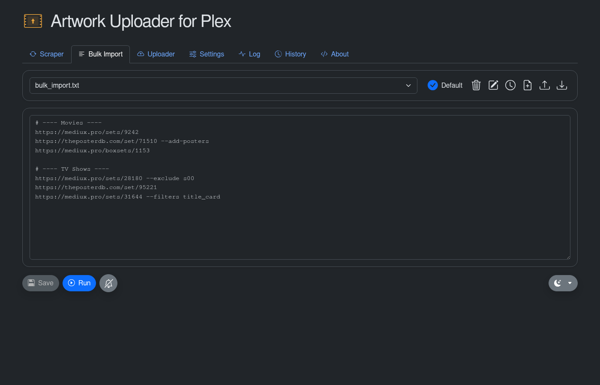
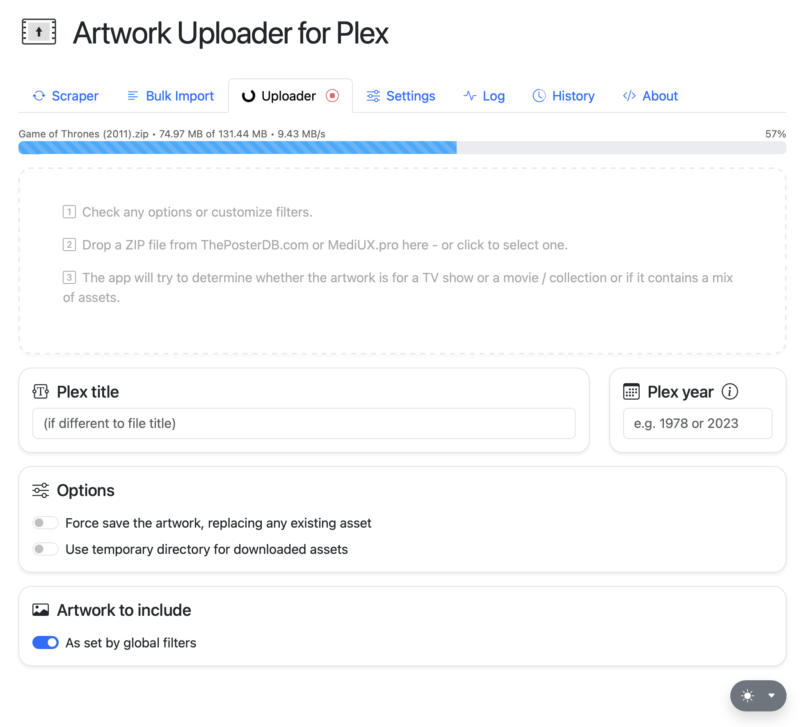
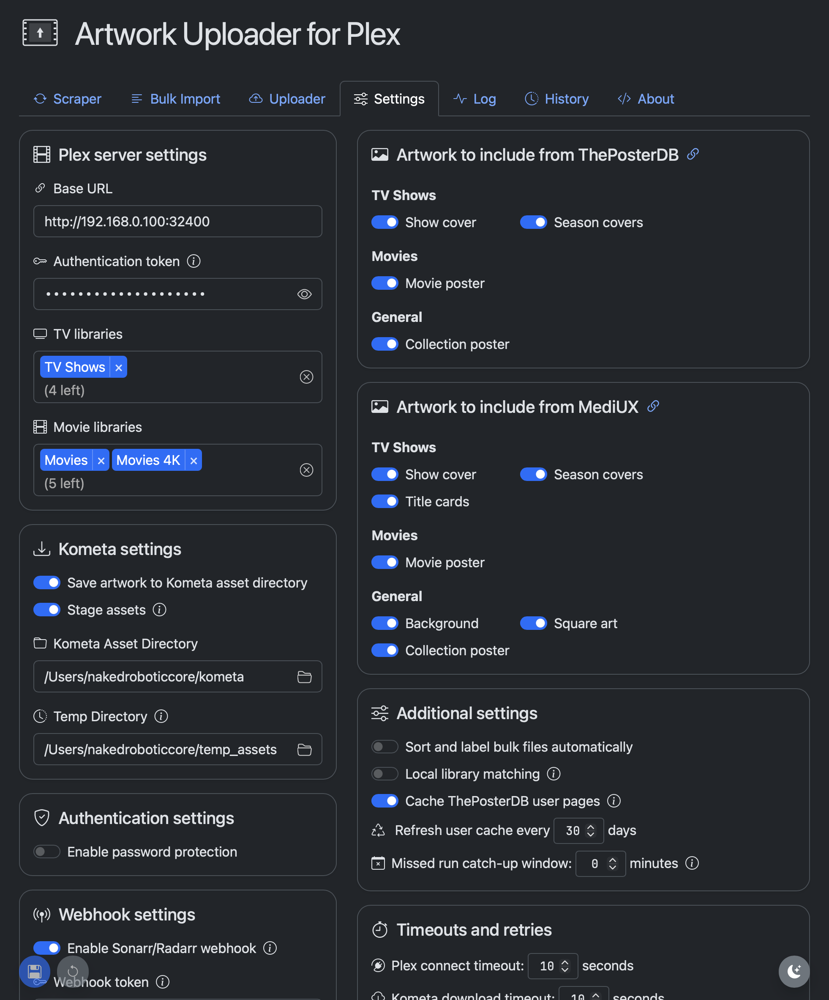
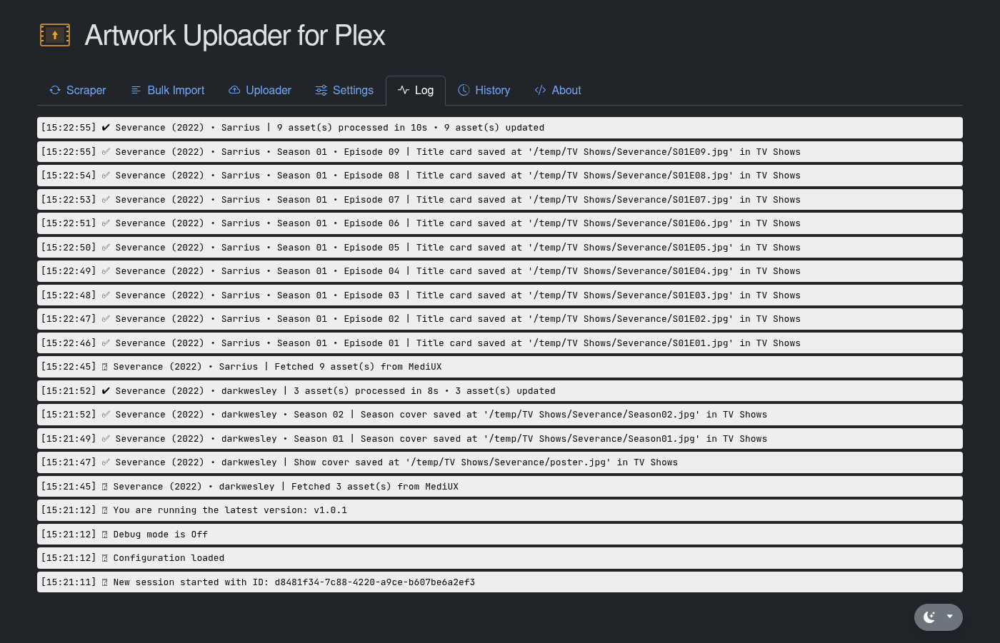
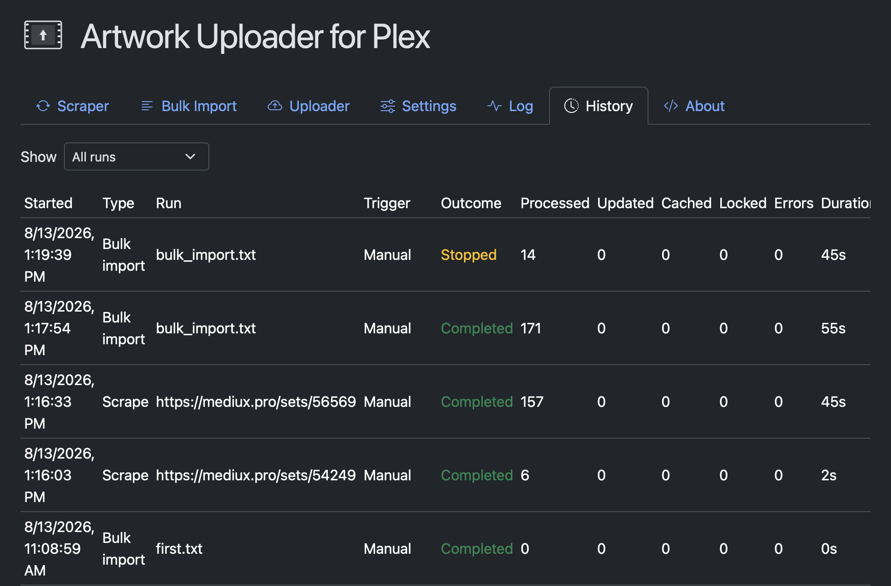
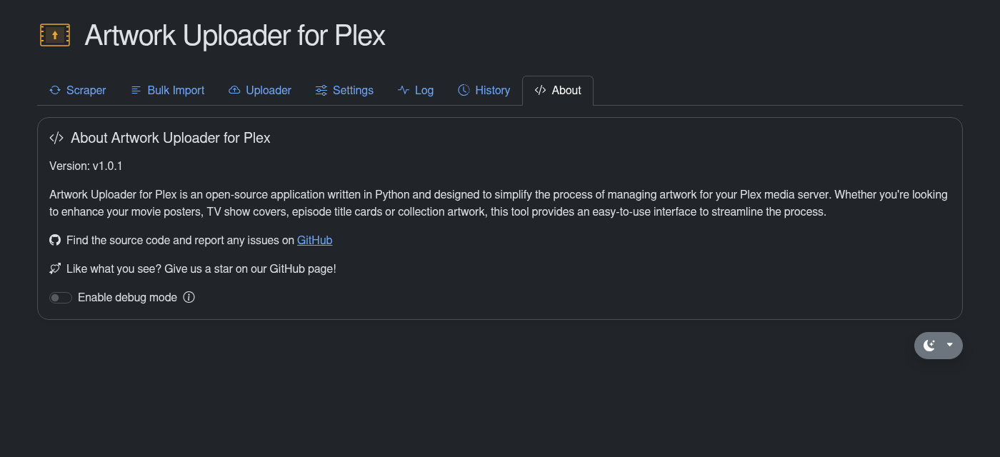

</details>

And a responsive mobile UI, perfected for using the app from your smartphone!

<details>
<summary>Mobile screenshots</summary>

<p>
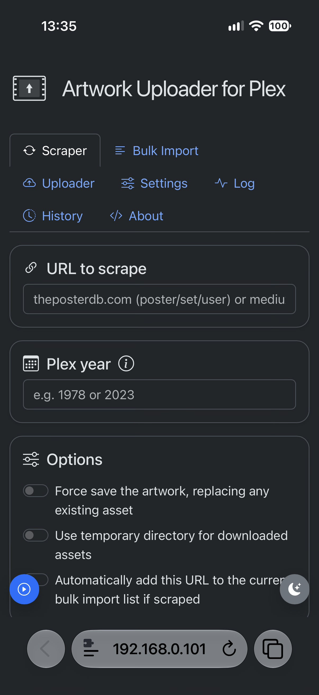
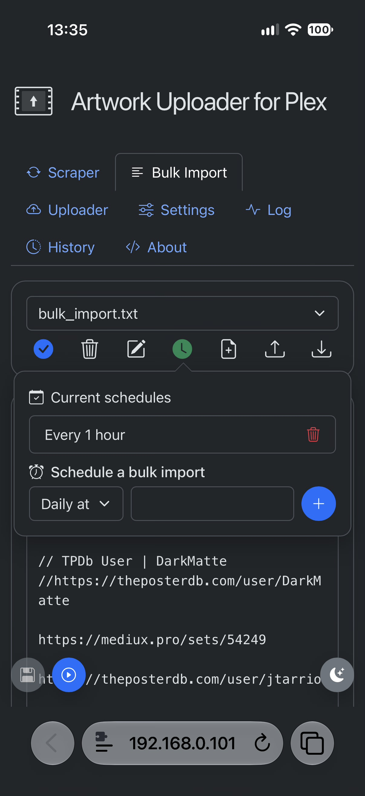
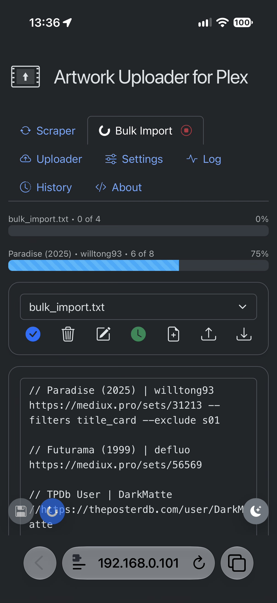
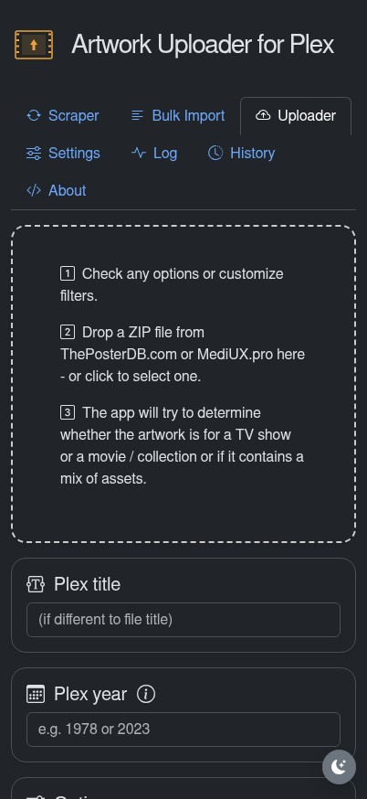
</p>
<p>
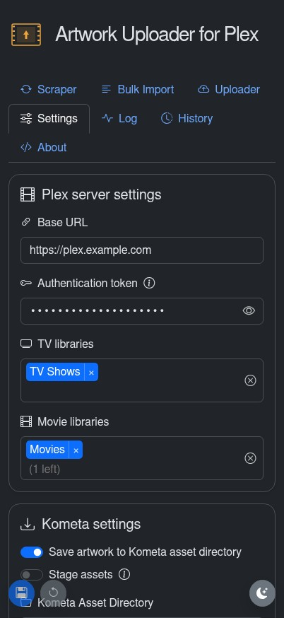
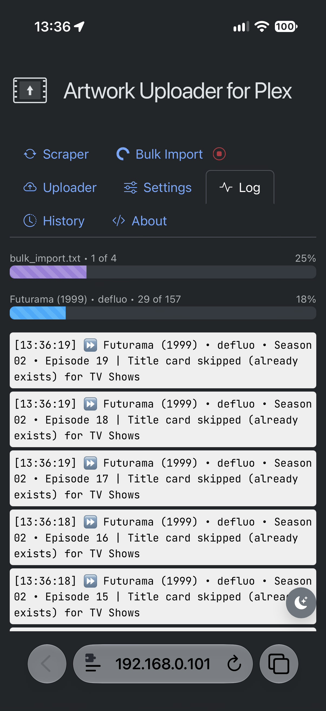
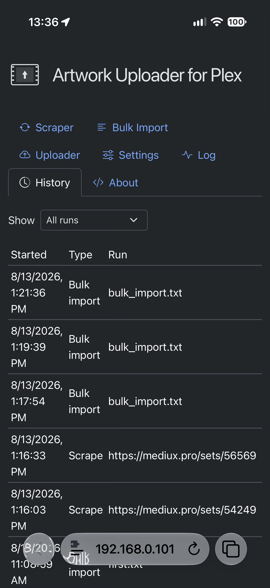
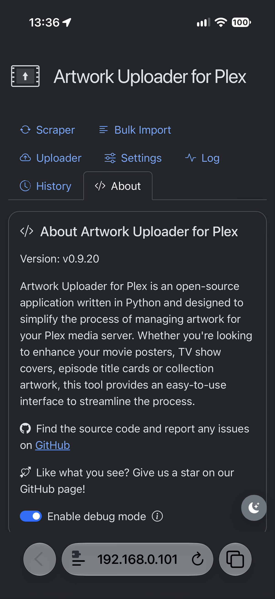
</p>

</details>

## Troubleshooting

### "Required dependencies are missing or incompatible"

Python packages can't be imported. Common causes:

1. **Requirements not installed**
   ```bash
   pip install -r requirements.txt
   # or
   python3 -m pip install -r requirements.txt
   ```

2. **Wrong Python version.** Artwork Uploader requires Python 3.12 or later:
   ```bash
   python3 --version
   ```

3. **Architecture mismatch (Apple Silicon Macs).** If you're on an M-series Mac and see errors about "incompatible architecture (have 'x86_64', need 'arm64')", your packages were compiled for Intel. Reinstall them for ARM64:
   ```bash
   pip3 uninstall Pillow Flask flask-socketio eventlet cffi cryptography -y
   pip3 install Pillow Flask flask-socketio eventlet cffi cryptography
   ```

4. **Not using the virtual environment.** If you created a `.venv` but still get import errors, you're likely running system Python:
   ```bash
   # Wrong - uses system Python ❌
   python3 artwork_uploader.py

   # Right - activate first, then run ✅
   source .venv/bin/activate
   python artwork_uploader.py

   # Alternative - run directly from venv ✅
   .venv/bin/python artwork_uploader.py
   ```

### "Cannot access localhost:4567" or "Server won't start"

If you see the scheduler messages but can't access the web UI:

1. **Check you're using the virtual environment** (see above).
2. **Check whether another process is using port 4567**:
   ```bash
   lsof -i :4567
   # If something is using it, either kill it or change the port in config.json
   ```
3. **Try the other local URLs**: `http://localhost:4567`, `http://127.0.0.1:4567`, `http://0.0.0.0:4567`.
4. **Check firewall settings** to make sure port 4567 isn't blocked.

### Strange "400 Bad request" errors in logs with binary data

Errors like this in your logs:

```
127.0.0.1 - - [13/Oct/2025 12:21:30] code 400, message Bad request version ('\x16\x03\x01...')
```

**This is completely normal and harmless!** They're TLS/SSL handshake attempts: something (your browser, an extension, or a security tool) is trying to connect over HTTPS to the HTTP-only Flask server, and Flask correctly rejects it. If you want HTTPS, put a reverse proxy like Nginx or Caddy in front.

### Plex connection issues

**"Cannot reach Plex server" or the application hangs on startup**

The app has a 3-second timeout for Plex connections and shows a clear error if it can't connect:

```
======================================================================
WARNING: Could not connect to Plex TV libraries
======================================================================
Cannot reach Plex server at http://192.168.1.4:32400. Please check
that the server is running and the address is correct.

The web UI will still start, but you won't be able to upload artwork
until you fix the Plex connection in Settings.
```

How to fix:

1. **Verify Plex is running.**
2. **Test connectivity manually**:
   ```bash
   curl http://your-plex-ip:32400
   # Should return some XML if Plex is accessible
   ```
3. **Check the IP address.** Your Plex server IP might have changed: Plex Web App → Settings → Network → Show Advanced.
4. **Update the Base URL** in Settings (or `config.json`).
5. **Firewall/network:** make sure port 32400 isn't blocked.

**"Invalid Plex token or base URL"**
- Verify your Plex token ([finding your Plex token](https://support.plex.tv/articles/204059436-finding-an-authentication-token-x-plex-token/)).
- The Base URL must include the protocol and port, e.g. `http://192.168.1.100:32400`.

**"Library not found"**
- Library names must match Plex exactly (case-sensitive), and the library type (TV vs Movie) must match too.

### Scraping issues

**"Can't scrape URL"**
- Verify the URL is from a supported source (ThePosterDB or MediUX).
- Check your internet connection.
- Some scrapers may be rate-limited. Wait a few minutes and try again.

### Performance issues

**Slow upload speeds**
- ThePosterDB has a 6-second rate limit between requests.
- Use `--filters` to only upload the artwork types you want.
- Turn on **Track artwork ID in Plex labels** so already-uploaded artwork is skipped.

## For developers

If you'd like to contribute or want to understand how it works under the hood, start with the [Technical Information for Contributors](TECHNICAL_INFO.md): architecture overview, service layer documentation, how to add features, testing procedures and code style guidelines.

## Thanks

Artwork Uploader began as a fork of Brian Brown's ([@bbrown430](https://github.com/bbrown430)) plex-poster-set-helper - what a fantastic idea, and it's saved us a load of time!
